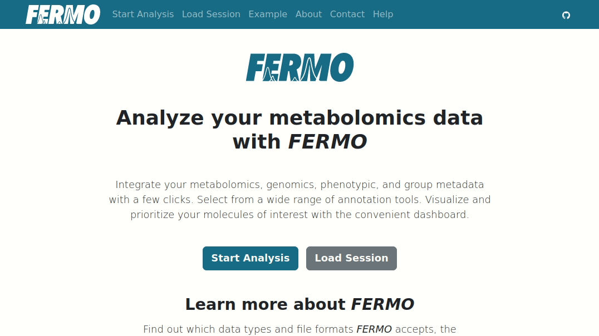
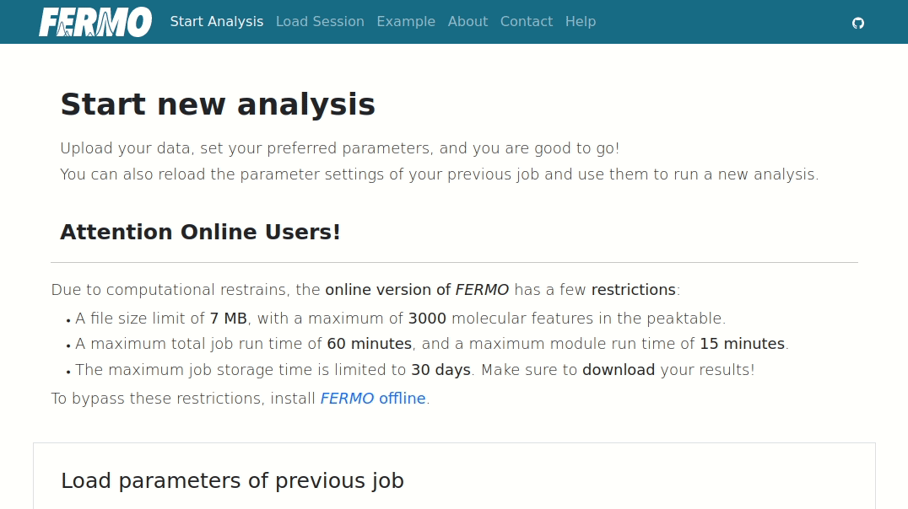

# Usage

On the 'Start Analysis' page, new *FERMO* analysis jobs can be initiated.

Files can be uploaded using the individual upload fields. 
The analysis job can be started by clicking on the **'Start Analysis'** button at the bottom of the page.

The **only** file required is a **peaktable file** - all other files are optional.

While default parameters are provided, they need to be adjusted according to the **requirements of the data**.

*Nota bene: *FERMO* online versions employs some restrictions with regard to file size, computation time, and data storage to prevent excessive usage. Details can be found on the 'Start Analysis' page.*

#### Example

{ width="60%" }

## Load parameters

This field allows to clone the parameter settings of a previous *FERMO* job (e.g. created by a colleague). 

To load the parameters, simply paste the *FERMO* job ID into the field, and click on the **'Load Job Parameters'** button.

*Nota bene: files and filenames are not retained and must be newly uploaded.*

#### Example

{ width="60%" }

#### Troubleshooting

If an old job ID does not exist anymore but you still want to clone the parameters, you can simply upload a previously created *FERMO* **session.json** file under [Load Session](./gui.load.md).
Take the newly generated *FERMO* job ID and use it to load the parameters.
