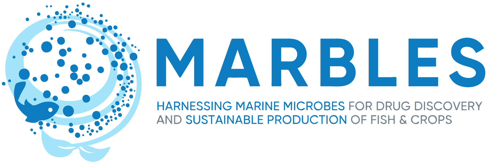
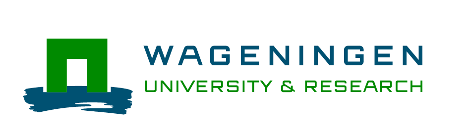

## FERMO Documentation

*FERMO* is a graphical dashboard application for metabolomics data analysis, with automated integration of phenotype data, group (meta)data, and genomic data. 

- [*FERMO* GUI](home/gui.overview.md) describes the usage and functionality of the dashboard application frontend.
- [`fermo_core`](home/core.overview.md) describes the backend data processing and analysis functionality of *FERMO*

This documentation has been last updated for *FERMO* **v1.1.0** and `fermo_core` **v0.5.0**

## How to use this documentation

- **Home**: describes the general usage and applicability of *FERMO*
- **Modules**: serves as reference to the individual modules integrated into *FERMO*

## About

### Websites
- [*FERMO Online*](https://fermo.bioinformatics.nl/): the online version of *FERMO*.
- [FERMO](https://github.com/fermo_metabolomics/fermo): repository of the graphical user interface frontend.
- [fermo_core](https://github.com/fermo_metabolomics/fermo_core): repository of the processing pipeline

### License

*FERMO* is open source software freely available under the permissive [MIT License](https://opensource.org/license/mit).

### Publication

See [*FERMO online*](https://fermo.bioinformatics.nl/) for information on citing `fermo_core`.

### Acknowledgements and Funding

<table style="border-collapse: collapse; width: 80%;">
  <tr>
    <td style="border: none; width: 50%;"></td>
    <td style="border: none; width: 50%;"></td>
  </tr>
  <tr>
    <td style="border: none; width: 50%; text-align: justify;">This work was funded by the European Union Horizon 2020 project MARBLES [101000392]</td>
    <td style="border: none; width: 50%; text-align: justify;">This work was supported by the Netherlands Organization for Scientific Research (NWO) KIC grant KICH1.LWV04.21.013</td>
  </tr>
</table>

